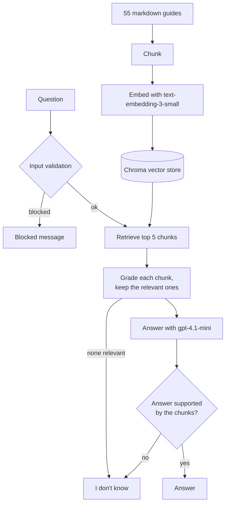

# VGC Strategy RAG System

DATA 790 Milestone 1. A Self-RAG question answering system over 55 Pokemon VGC (doubles)
strategy guides. It answers from the guides and says "I don't know" when they do not cover
the question.

## Architecture



## Files

```
rag_system.py      the pipeline: loading, chunking, vector store, validation, Self-RAG, evaluation
milestone1.ipynb   runs each part and shows the results
golden_set.json    20 in-scope questions with the guides that answer them, 5 out-of-scope questions
data/vgc_docs/     the 55 strategy guides
```

## Running It

```bash
pip install -r requirements.txt
cp .env.example .env    # then add your UNC_AI_API_KEY
```

Then open `milestone1.ipynb` and run all cells.
